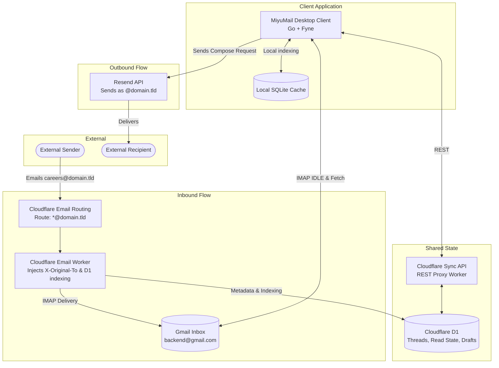

# MiyuMail

A lightweight, self-hostable, stateful desktop email client for small teams. Built to provide multiple virtual mailboxes (`careers@`, `legal@`, `hi@`) on your own domain using free (pay-as-you-scale) infrastructure. It uses Cloudflare Email Routing to receive mail, a hidden Gmail IMAP backend for durable storage, Resend for outbound delivery, and Cloudflare D1 to synchronize read/unread states, threads, and drafts across your entire team.

---

## Stack

| Layer | Tech |
|---|---|
| Language | Go 1.27+ |
| UI Framework | Fyne (Cross-platform native GUI) |
| Inbound Routing | Cloudflare Email Routing + Cloudflare Email Workers |
| Shared State Store | Cloudflare D1 (Serverless SQLite) |
| Email Provider (Outbound) | Resend API |
| Storage Backend (Inbound) | Gmail IMAP (Invisible to senders/recipients) |
| Local Cache | SQLite 3 |

---

## Features

- **True Two-Way Sync:** Mark an email as read, archive it, or star it, and the state synchronizes globally across the entire team via Cloudflare D1 and Gmail IMAP IDLE.
- **Invisible Backend Storage:** Uses a single generic Gmail inbox for reliable, massive, free IMAP storage. The Gmail address is *never* exposed to the outside world; all mail appears to originate natively from your custom domain.
- **Multiple Virtual Identities:** Handle `support@`, `careers@`, and `noreply@` all from a single window.
- **Smart Reply Routing:** When you hit reply, MiyuMail automatically detects which virtual identity received the email and sends the reply from that exact address.
- **Native OS Packaging:** Packaged natively for Windows `.exe`, macOS `.app`, and Linux using Fyne.
- **Low Operating Cost:** Leverages generous free tiers (Cloudflare Email Routing, D1, Resend's 100 emails/day, Gmail's 15GB).

---

## Architecture



### Core Abstractions

| Abstraction | Implementation |
|---|---|
| `SyncEngine` | Coordinates fetching new UIDs from Gmail, parsing RFC 5322 payloads, and persisting to SQLite. |
| `IDLEListener` | Maintains a dedicated background IMAP connection to instantly detect incoming mail. |
| `ThreadEngine` | Groups messages by RFC 5322 `Message-ID`, `In-Reply-To`, and `References` headers. |
| `IdentityResolver` | Resolves which virtual mailbox an email belongs to using `X-Original-To` or `To/Cc` fallbacks. |
| `Sender` | Outbound delivery via the Resend API, enforcing custom domain headers. |

---

## Local Setup & Team Distribution

### 1. Prerequisites

- Go 1.27+ (for building)
- Node.js 24+ / `wrangler` CLI (for deploying Cloudflare Workers)
- A domain managed on Cloudflare
- A generic Gmail account (for IMAP backend storage)
- A Google Cloud Project (for OAuth2 credentials)
- A Resend Account (for outbound delivery)

### 2. Cloudflare & Provider Setup

- **Cloudflare:** Read [cloudflare/README.md](./cloudflare/README.md) to deploy the Email Worker, the Sync API Worker, and the D1 database. Note down your `sync-api worker url` & `MAIL_SYNC_TOKEN`.
- **Gmail:** Enable the Gmail API in Google Cloud Console, and generate an **OAuth client ID** (Desktop app).
   1. Go to [Google Cloud Console](https://console.cloud.google.com/).
   2. Create a project and enable the **Gmail API** (APIs & Services → Library).
   3. Configure the **OAuth consent screen** → **Data access** → **Add or Remove Scopes** → add scope `https://mail.google.com/`.
   4. Create **OAuth client ID** (type: Desktop app), note the `client_id` and `client_secret`.
- **Resend:** Verify your domain on Resend and generate an API key.
   1. Sign up at [resend.com](https://resend.com).
   2. Add and verify your domain under **Domains**.
   3. Follow the DNS instructions (DKIM, SPF, DMARC records).
   4. Copy your `API Key` from **API Keys**.

### 3. Configure the Application

You do **not** need to manually copy configuration files anymore! The application handles this automatically.

When you launch MiyuMail for the first time, it will auto-generate a default `config.toml` at `~/.config/mail/config.toml` (or your OS equivalent path) and display its location in the GUI Setup Wizard so you can update your domains, mailbox address and oauth credentials there.

### 4. Installation & Distribution (For your team)

**Option A: Pre-built Binaries (Recommended)**
You can download the latest pre-packaged application for your OS directly from the [GitHub Releases](../../releases) page.
- **Windows**: Download `MiyuMail-Windows.zip` (contains `MiyuMail.exe`), extract, and run.
- **macOS**: Download `MiyuMail-macOS.zip`, double-click to extract, and drag `MiyuMail.app` to your `Applications` folder.
- **Linux**: Download `MiyuMail-Linux.zip`, extract it, and run `sudo make install` for a system-wide installation or `make user-install` for a user-local installation.

**Option B: Build Manually**
MiyuMail uses Fyne to package the application into a native, standalone bundle (`.app`, `.exe`, or Linux executable). 

```bash
# Install Fyne CLI
go install fyne.io/fyne/v2/cmd/fyne@latest

# Package the application bundle
make package
```

**To distribute to your team:**
1. Send them the packaged executable (e.g., `MiyuMail.app` or `MiyuMail.exe`), or have them download it from Releases.
2. They just double-click the app! The application will automatically detect they are a new user and launch the native GUI Setup Wizard. Ask them to populate the correct values in `~/.config/mail/config.toml` or send pre-populated `config.toml` file over a secure-channel and ask them to replace it.

### 5. First-Time Authentication

When a team member launches the app for the first time, the native GUI Setup Wizard will automatically appear and prompt them to:
- Fill in their credentials in the auto-generated `config.toml` file.
- Enter the Resend API key directly into the secure UI.
- Enter the `MAIL_SYNC_TOKEN` directly into the secure UI.
- Authenticate with the generic Gmail account via a browser popup by clicking the "Authorize Gmail" button.

These secrets will then be stored securely in the OS Keychain, and the app will boot up seamlessly.

---

## CLI Commands & Usage

### Make Targets

| Command | Description |
|---|---|
| `make build` | Compiles a raw Go binary into `bin/` (`mail`) |
| `make package` | Bundles a full GUI app (`MiyuMail.app`/`MiyuMail.exe`) using Fyne with the app icon |
| `make run` | Instantly runs the application via `go run` |

---

## Free Tier Budget

| Service | Free Tier | Typical Usage (5-person team) |
|---|---|---|
| Cloudflare Email Routing | Unlimited | ~50 inbound emails/day |
| Cloudflare Email Worker | 100K requests/day | ~50 invocations/day |
| Cloudflare D1 | 5M reads, 100K writes/day | ~5K reads, ~500 writes |
| Cloudflare Workers (Sync API) | 100K requests/day | ~2K requests/day |
| Resend | 100 emails/day, 3K/month | ~20 outbound/day |
| Gmail | 15GB storage | Grows slowly over years |

**Total Operating Cost: $0/month.**

---

## License

[GNU AGPL v3](LICENSE).
Copyright (c) 2026 MiyuLabs.
